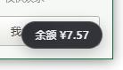
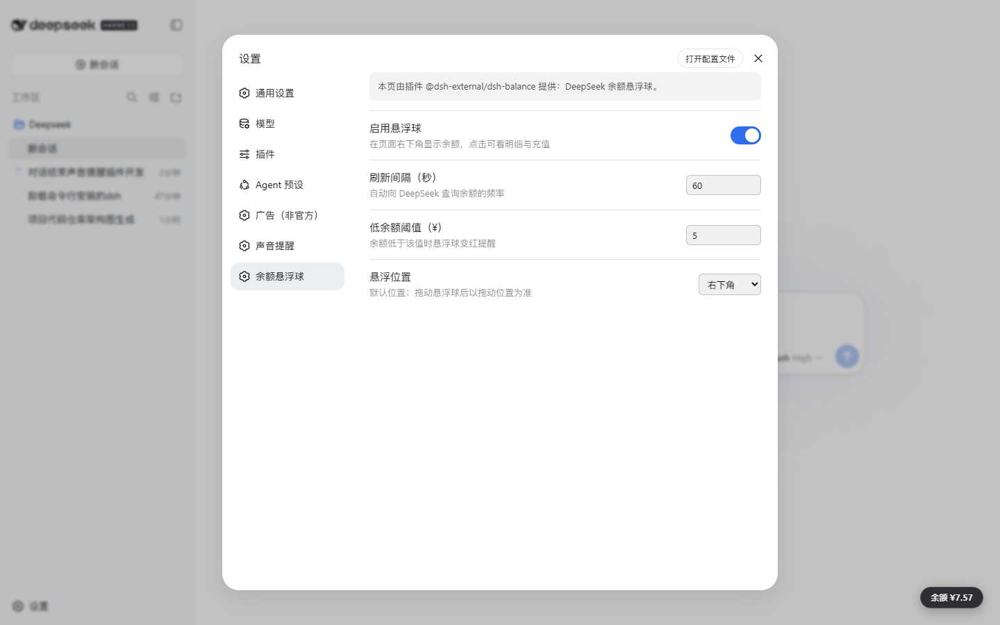

# 余额悬浮球（@dsh-external/余额悬浮球）

DSH Web 插件：**右下角悬浮显示 DeepSeek 账户余额，点击直达官网充值页**。

- 悬浮胶囊实时显示总余额（如 `余额 ¥110.00`），可**拖动**到任意位置（记忆在 localStorage）；
- 点击展开明细卡片：总余额 / 充值余额 / 赠送余额、最近更新时间、**刷新**与**去充值 ↗** 按钮；
- 余额低于阈值（默认 ¥5）时胶囊变红并带 ⚠ 告警；
- 服务端代理余额接口，`DEEPSEEK_API_KEY` 密钥只留在服务端，**不会进入浏览器**；
- 60 秒自动刷新（页面隐藏时暂停，回到前台立即补一次）。

## 截图

右下角悬浮球（点击展开明细与充值入口）：



设置 → 「余额悬浮球」页（开关 / 刷新间隔 / 低余额阈值 / 悬浮位置）：



## 架构

```
浏览器端（悬浮球 UI）  --fetch-->  服务端代理 /dsh-balance/balance  --fetch-->  DeepSeek API
   lib/client.js                    lib/index.js (ctx.webServer + ctx.credentials)   api.deepseek.com/user/balance
```

服务端通过 `ctx.credentials` 解析 `DEEPSEEK_API_KEY`（DSH 凭证系统，当前已配置），
带 `Authorization: Bearer` 请求 `https://api.deepseek.com/user/balance`，结果缓存 60 秒。

## 配置

在 `cordis.patch.yml`（本包自带，可被 profile 的 patch 覆盖）中调整：

| 配置项 | 默认值 | 说明 |
|---|---|---|
| `cacheSeconds` | `60` | 服务端余额缓存秒数 |
| `topUpUrl` | `https://platform.deepseek.com/top_up` | 充值页地址 |
| `enabled` | `true` | 是否启用悬浮球 |
| `refreshSeconds` | `60` | 客户端自动刷新间隔秒数 |
| `lowBalanceThreshold` | `5` | 余额低于该值（CNY）时红色告警 |
| `position` | `bottom-right` | 默认悬浮位置（`bottom-right` / `top-right` / `bottom-left` / `top-left`） |

## 安装（从 GitHub）

```sh
# 加入 web profile 的依赖（声明 dsh.bundle，dsh plugin 会自动追加进 bundles）
dsh plugin --profile web add github:mxl2498/dsh-balance
# 然后重启 DSH Desktop / dsh web
```

本地开发时也可用 `dsh plugin --profile web add file:../dsh-balance` 安装本地目录。

## 注意

- 余额接口以 `balance_infos` 第一项为准（一般即 CNY 账户）；多币种时卡片会列出各项。
- 若显示"余额 --"，把鼠标悬停在胶囊上看具体错误（未配置密钥 / HTTP 状态 / 网络失败）。
- 充值页需要登录 DeepSeek 开放平台账号。
